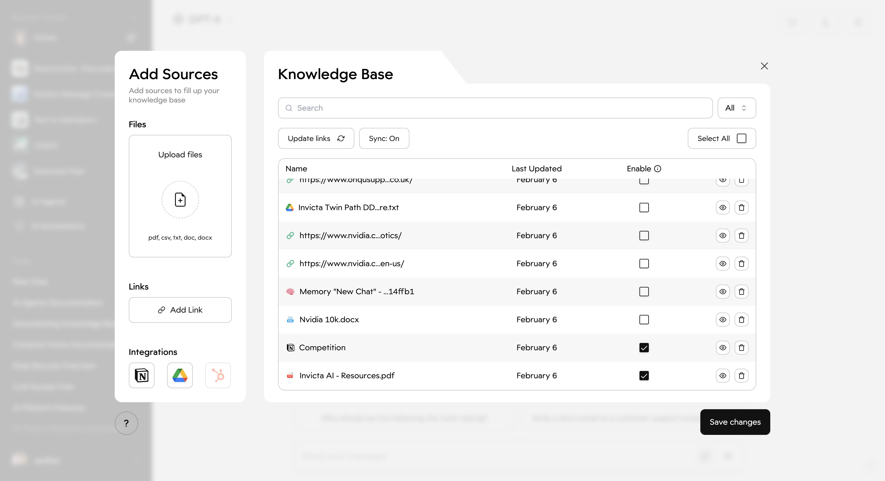
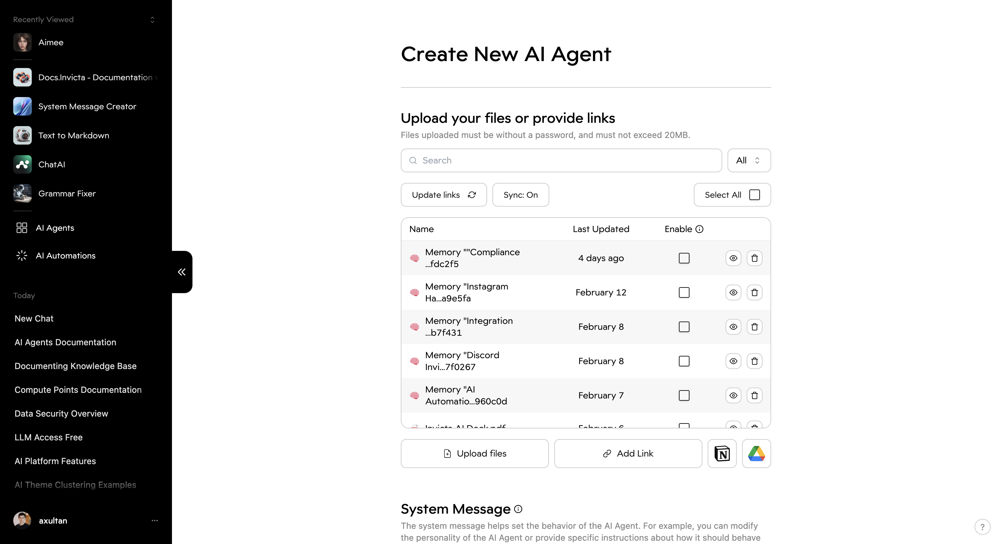

The Knowledge Base within our AI Agents platform is a critical component that serves as the informational foundation for our agents, enabling them to access, retrieve, and utilize data effectively in their interactions and tasks. This documentation will provide an in-depth explanation of the Knowledge Base, its features, and how it integrates with data sources such as Google Drive to ensure real-time synchronization.

## Introduction to Knowledge Base

The Knowledge Base is a repository where various types of data are stored and managed to support the intelligence and responsiveness of AI agents. It contains structured and unstructured data including text documents, spreadsheets, web links, and other file types, which can be leveraged by the agents for various purposes.

### Key Features:

- **Data Variety Support**: The Knowledge Base accepts a wide array of file formats such as PDF, CSV, TXT, and others.
- **Real-time Synchronization**: Certain data sources like Google Drive are directly integrated to reflect any changes instantaneously.
- **Agent-Specific Silos**: Data can be sectioned into silos per agent, restricting access and preventing unintended sharing of sensitive information.
- **Continuous Improvement**: The system employs mechanisms for self-improvement by regularly updating indexing, retrieval, generation, and action success metrics.

## Real-Time Synchronization

One of the paramount features of our Knowledge Base is its capability to stay in sync with connected data sources like Google Drive. When updates or modifications are made to files within these sources, our platform ensures that these changes are mirrored promptly in the Knowledge Base. This feature ensures that AI agents are operating with the most up-to-date information available without manual intervention.

## Managing Your Knowledge Base

### Adding Data Sources

To add a new data source to your Knowledge Base:

1. Navigate to the 'Knowledge Base' button in your AI Agent chat interface or go to the AI Builder,
   

2. Choose one of the available data sources from the list of available options.
   

     
   

   

     
   

3. Select which files you wish to upload or follow the prompts to authorize your account first.

## Conclusion

The Knowledge Base is an essential tool that empowers AI Agents with relevant and current information required for responding to queries and performing tasks effectively. With real-time synchronization capabilities like those with Google Drive, users can rest assured that their agents are always informed with the most recent data.

For any assistance or further clarification regarding the setup and management of your Knowledge Base, please refer to our support resources or contact our help desk directly.
